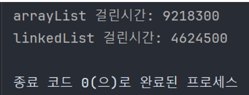

# List

- 배열처럼 객체를 일렬로 늘어놓은 구조
- 배열은 선언 시점에 자료형 크기를 결정하면 수정을 못하지만 List 컬렉션은 자료형 크기를 수정할 수 있음
- List 컬렉션은 객체 자체를 저장하는 것이 아닌 객체의 번지를 참조

## List 인터페이스의 메서드

- `boolean add(E e)`: 주어진 객체를 맨 끝에 추가
- `void add(int index, E element)`: 주어진 인덱스에 객체 추가
- `set(int index, E element)`: 주어진 인덱스에 저장된 객체를 주어진 객체로 바꿈

- `boolean contains(Object o)`: 주어진 객체가 저장되어있는지 여부
- `E get(int index)`: 주어진 인덱스에 저장된 객체를 리턴
- `isEmpty()`: 컬렉션이 비어있는지 여부
- `int size()`: 저장되어 있는 전체 객체 수 리턴

- `void clear()`: 저장된 모든 객체를 삭제
- `E remove(int index)`: 주어진 인덱스에 저장된 객체 삭제
- `boolean remove(Object o)`: 주어진 객체를 삭제

## ArrayList

List 인터페이스의 구현 클래스

객체가 추가되면 인덱스로 관리

배열과 달리 저장 용량을 초과한 객체들이 들어오면 자동적으로 저장 용량이 늘어남

기본 구조

```java
// E 객체 10개를 저장할 수 있는 초기 용량을 가짐
List<E> list = new ArrayList<>(초기 용량 지정);
```

ArrayList에 객체를 추가하면 인덱스 0부터 차례대로 저장

특정 인덱스의 객체를 제거하면 그 뒤의 인덱스들 모두 앞으로 1씩 당겨짐

반대로 특정 인덱스에 객체를 삽입하면 뒤의 인덱스들 모두 뒤로 1씩 밀림

이 과정에서 리소스 잡아먹으므로 객체 삭제나 삽입이 빈번할 때에는 ArrayList 사용 지양하기

요소를 추가, 삭제, 출력 해보면

```java
List<String> arrayList = new ArrayList<>();
arrayList.add("Java");
arrayList.add("Spring");
arrayList.add("Servlet/JSP");
arrayList.add("DBMS");
arrayList.add("JPA");

for(String str : arrayList){
  System.out.println(str);
}

System.out.println("=================");

arrayList.add(2, "hello");
for(String str : arrayList){
  System.out.println(str);
}

System.out.println("=================");

arrayList.remove(2);
for(String str : arrayList){
  System.out.println(str);
}
```

```
실행 결과

=================
Java
Spring
Servlet/JSP
DBMS
JPA
=================
Java
Spring
hello
Servlet/JSP
DBMS
JPA
=================
Java
Spring
Servlet/JSP
DBMS
JPA
```


## LinkedList

List의 구현 클래스

LinkedList는 인접 참조를 링크해서 체인처럼 관리

따라서 특정 인덱스의 객체를 제거하거나 삽입할 때 앞뒤 링크만 변경되고 나머지 링크는 그대로 유지

LinkedList의 기본 구조

```java
// 처음 생성할 때 링크가 없으므로 내부는 비어있음
List<E> list = new LinkedList<>();
```

### ArrayList와 LinkedList 비교

- ArrayList는 객체들이 각자 방에 있다가 객체가 삽입되거나 삭제될 때 뒤의 객체들이 각자 방 빼서 옮기는 느낌
- LinkedList는 객체들이  줄 지어 옆의 객체들이랑 손 잡고 있다가 객체가 삽입되거나 삭제될 때 해당 주변 객체들이 잡던 손 놓고 다른 객체랑 손 잡는 느낌

ArrayList와 LinkedList에 10,000개의 객체를 삽입하는 데 걸린 시간을 측정

```java
List<String> arrayList = new ArrayList<>();
List<String> linkedList = new LinkedList<>();

long startTime, endTime;
startTime = System.nanoTime();
for (int i = 0; i < 10000; i++) {
  arrayList.add(0, String.valueOf(i));
}
endTime = System.nanoTime();
System.out.println("arrayList 걸린시간: " + (endTime - startTime));

startTime = System.nanoTime();
for (int i = 0; i < 10000; i++) {
  linkedList.add(0, String.valueOf(i));
}
endTime = System.nanoTime();
System.out.println("linkedList 걸린시간: " + (endTime - startTime));
```

엄청 차이남
